


---

## 功能演示

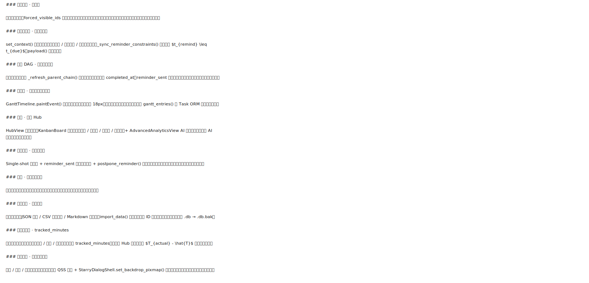


### 截图素材与 README 依赖映射

`docs/demo/` 中已补齐 README 当前使用的全部演示素材，来源于 `screenshot/`：

| README 引用文件 | 来源素材 |
|:---|:---|
| `01-today-view.svg` | `今日任务.png` |
| `02-create-task.svg` | `创建任务.gif` |
| `03-parent-child-dag.svg` | `子任务全部完成父任务自动完成.gif` |
| `04-gantt-view.svg` | `甘特图时间轴.png` |
| `05-calendar-view.svg` | `日历使用.gif` |
| `06-kanban-board.svg` | `工作台任务查阅.gif` |
| `08-reminder-dialog.svg` | `任务提醒.gif` |
| `10-export-import.svg` | `数据持久化展示.gif` |
| `12-theme-settings.svg` | `主题切换.gif` |
| `14-focus-timer.svg` | `专注计时.gif` |

其余补充素材（如 `AI深度分析.gif`、`按日期筛选任务.gif`、`背景图片切换.gif` 等）也已同步到 `docs/demo/`，便于后续继续扩展 README 演示内容。

---

## 快速开始

### 安装与启动

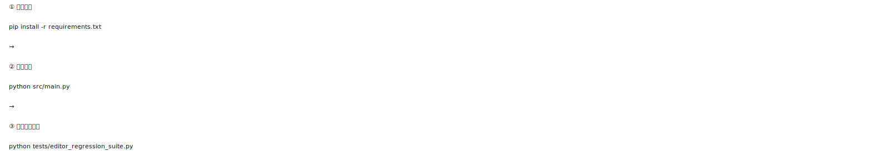


### 首次启动自动化流程

首次启动无需手动干预，系统自动完成：

| 步骤 | 函数 | 说明 |
|:---:|:---|:---|
| ① | `_configure_qt_font_directory()` | Qt 字体路径注入 |
| ② | `load_config()` | 加载 `app_config.json` + 日志 |
| ③ | `DB()` | ORM 初始化 + `_ensure_schema()` 自动迁移 |
| ④ | `seed_database_if_empty(db)` | 演示数据植入（幂等） |
| ⑤ | `get_theme_profile()` | 读取主题配置 |
| ⑥ | `apply_theme(...)` | 全局样式装配 |
| ⑦ | `MainWindow().showMaximized()` | 主窗口上屏（默认 today 视图） |
| ⑧ | `app.exec()` | 进入 Qt 事件循环 |

---

## 系统架构总览

### 五区架构


### 单向数据流


> [!TIP]
> `refresh_everything()` 是**唯一重绘入口**。所有视图均通过此函数获取最新状态，彻底消除「界面先变、写入数据库失败」的 State Drift 竞态问题。

### 核心函数定位点

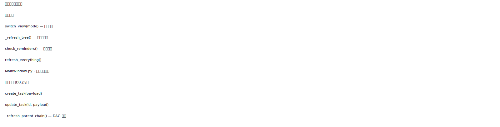


---

## 目录结构

```text
Task-Forge/
├─ README.md                         # 项目说明（课程要求）
├─ requirements.txt                  # 依赖列表（课程要求）
├─ src/                              # 源代码（课程要求）
│  ├─ main.py
│  ├─ MainWindow.py
│  ├─ DB.py
│  ├─ Task.py
│  ├─ Note.py
│  ├─ runtime_support.py
│  ├─ assets/
│  └─ ui/
├─ data/                             # 数据文件（课程要求）
│  ├─ app_config.json
│  ├─ categories.json
│  ├─ demo_data.json
│  └─ task_forge.db.bak
├─ docs/                             # AI 使用说明文档（课程要求）
│  ├─ AI使用说明.tex
│  ├─ AI使用说明.pdf
│  ├─ AI使用说明.md
│  ├─ fonts/                         # README/TeX 需要的本地字体
│  │  ├─ NotoSansSC-VF.ttf
│  │  └─ NotoSerifSC-VF.ttf
│  └─ demo/
├─ tests/                            # 回归测试（扩展内容）
├─ scripts/                          # 工具脚本（扩展内容）
└─ screenshot/                       # 演示录屏素材（扩展内容）
```

> [!NOTE]
> 为保证 README 表格和 `docs/AI使用说明.tex` 在不同机器上的中文排版一致性，项目已将所需字体放入 `docs/fonts/`。若本机已安装同名字体，系统会优先使用本机字体。

---

## 数据模型

### Task 实体（19 字段）

> 定义于 [`src/Task.py`](src/Task.py)，SQLAlchemy 2.0 DeclarativeBase 风格，自引用 DAG 外键。

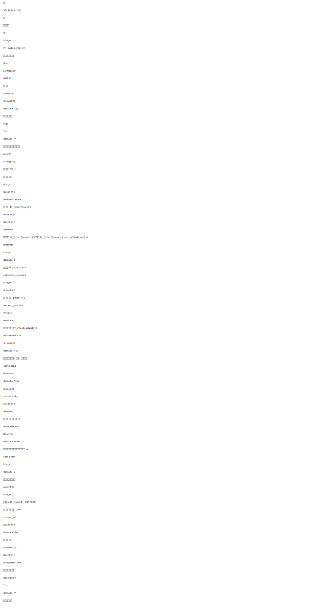


### 核心字段形式化语义

**父节点进度聚合：**

$$P_{\text{parent}} = \begin{cases} 100 & \forall\, c \in \text{children}(t),\ c.\text{completed} = \texttt{True} \\ \left\lfloor \dfrac{\sum_{c} c.P}{|\text{children}(t)|} \right\rfloor & \text{otherwise} \end{cases}$$

**效率偏差（分析 Hub 核心指标）：**

$$\Delta T = T_{\text{actual}} - \hat{T}$$

**截止与提醒时间约束：**

$$t_{\mathrm{remind}} \le t_{\mathrm{due}}$$

由 `_sync_reminder_constraints()` 实时强制执行。

### Note 实体（6 字段）


### 冷启动迁移策略

`DB.py` 内建两种零摩擦迁移机制：

1. **`_ensure_schema()`** — `ALTER TABLE` 追加缺失列（`tags`、`tracked_minutes`、`progress`、`recurrence_rule`），无需手动脚本
2. **`_resolve_db_path()`** — 自动升级历史命名 `task_studio.db → task_forge.db`

---

## 核心机制：父子 DAG 联动

### 内存索引结构

```python
# src/MainWindow.py — 每次 refresh_everything() 后重建
self.task_map:      dict[int, Task]           # O(1) 任务查找
self.children_map:  dict[int, list[Task]]     # 子树枚举与递归计算
```

### DAG 状态转换图

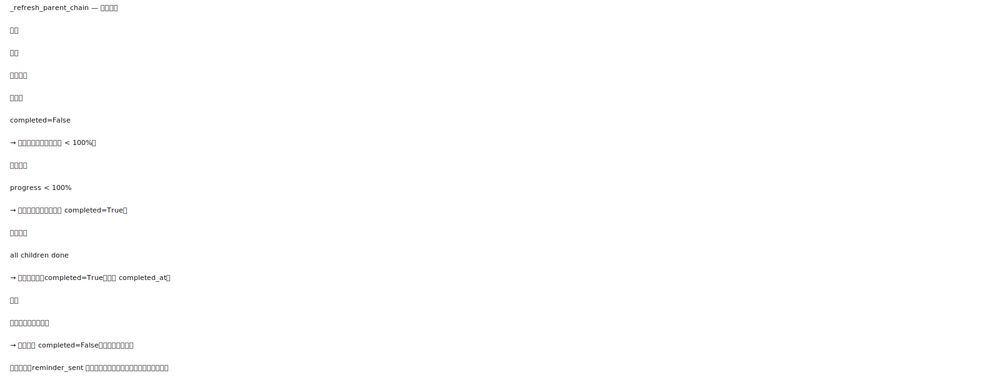


### `_refresh_parent_chain` 三条不变量

位于 [`src/DB.py`](src/DB.py)：

1. **全量完成** → 父节点自动 `completed=True`，写入 `completed_at`
2. **任一子节点未完成** → 父节点强制回退 `completed=False`
3. **向上递归** 直至 `parent_id IS NULL`（树根）为止

### 子任务可见性策略

`forced_visible_ids` 机制解决过滤视图下的可见性断区：


---

## 核心机制：提醒调度引擎

### 调度时序图


### `reminder_sent` 状态转换矩阵


> [!IMPORTANT]
> **架构约束**：严禁绕过 SQLAlchemy Session 直接写 `task_forge.db`。`reminder_sent` 的原子性完全依赖事务——绕过 ORM 将导致提醒重复触发。

---

## 任务编辑器

> 核心类：`TaskEditorView` — [`src/ui/task_composer.py`](src/ui/task_composer.py)

### 三模式上下文注入

```python
# 独立新建任务
set_context(task=None,  preferred_parent_id=None,  parent_title=None)

# 编辑已有任务（回显全部字段）
set_context(task=task,  preferred_parent_id=None,  parent_title=None)

# 创建子任务（fixed_parent_id 锁定，防止提交时解除父子关系）
set_context(task=None,  preferred_parent_id=pid,   parent_title=title)
```

### 提交载荷结构与交互约束


---

## 多视图体系

### 11 种视图模式

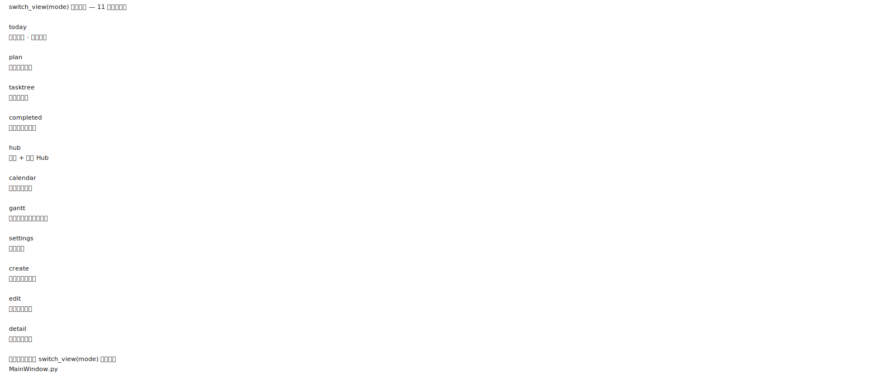


---

## 数据看板与分析


---

## 导入导出与数据安全

### 导出接口总览

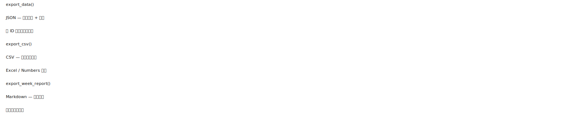


> [!CAUTION]
> `import_data()` 执行覆盖性导入。操作前请先确认 `task_forge.db.bak` 时间戳为最新，或手动执行 `export_data()` 备份当前数据。

---

## 质量保障矩阵


---

## AI 协作上下文

### 架构约定（CLAUDE.md 兼容格式）


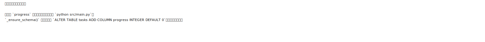


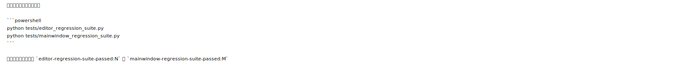


---

## 演进路线图


---

## 常见问题


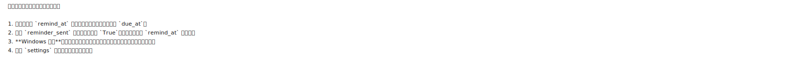


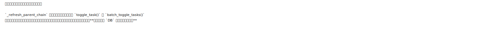


---

## 附录

### 附录 A · 主要入口文件速查

| 类别 | 路径 | 说明 |
|:---:|:---|:---|
| 应用启动 | [`src/main.py`](src/main.py) | 8 步启动序列 + 主题装配 |
| 主窗口路由 | [`src/MainWindow.py`](src/MainWindow.py) | 视图切换 + 提醒调度 + 内存索引重建 |
| 数据访问区 | [`src/DB.py`](src/DB.py) | 所有数据操作的 SSOT，唯一写入通道 |
| 任务 ORM | [`src/Task.py`](src/Task.py) | 19 字段 + 自引用 DAG 关系定义 |
| 便签 ORM | [`src/Note.py`](src/Note.py) | 6 字段便签实体 |
| 任务编辑器 | [`src/ui/task_composer.py`](src/ui/task_composer.py) | `TaskEditorView` + `set_context()` + `payload()` |
| 看板与分析 | [`src/ui/hub_view.py`](src/ui/hub_view.py) | `HubView` · `KanbanBoard` · `AdvancedAnalyticsView` |
| 甘特图 | [`src/ui/gantt_view.py`](src/ui/gantt_view.py) | `GanttView` · `GanttTimeline.paintEvent()` |
| 编辑器回归 | [`tests/editor_regression_suite.py`](tests/editor_regression_suite.py) | 7 测试域 |
| 主窗口回归 | [`tests/mainwindow_regression_suite.py`](tests/mainwindow_regression_suite.py) | 8 测试域 |

### 附录 B · 术语表

| 术语 | 含义 |
|:---|:---|
| **Local-First** | 数据优先驻留本地，操作优先本地生效，离线环境完整可用 |
| **SSOT** | Single Source of Truth，单一事实来源（此处为 `DB.py`） |
| **DAG** | Directed Acyclic Graph，有向无环图，保证父子任务引用无循环 |
| **State Drift** | 视图状态与持久化状态不一致的竞态现象 |
| **Debounce Lock** | `reminder_sent` 字段实现的防重复提醒互斥锁 |
| **Payload** | `TaskEditorView.payload()` 装配的任务数据字典，为 DB API 统一入参 |
| **`forced_visible_ids`** | 强制可见集合，防止新建子任务在受限过滤视图中消失 |
| **Single-shot Timer** | `reminder_timer.setSingleShot(True)`，到期后不自动重启，精准调度 |
| $\hat{T}$ | `estimated_minutes`，任务预估投入时长 |
| $T_{\text{actual}}$ | `tracked_minutes`，实际累计专注投入时长 |

---


